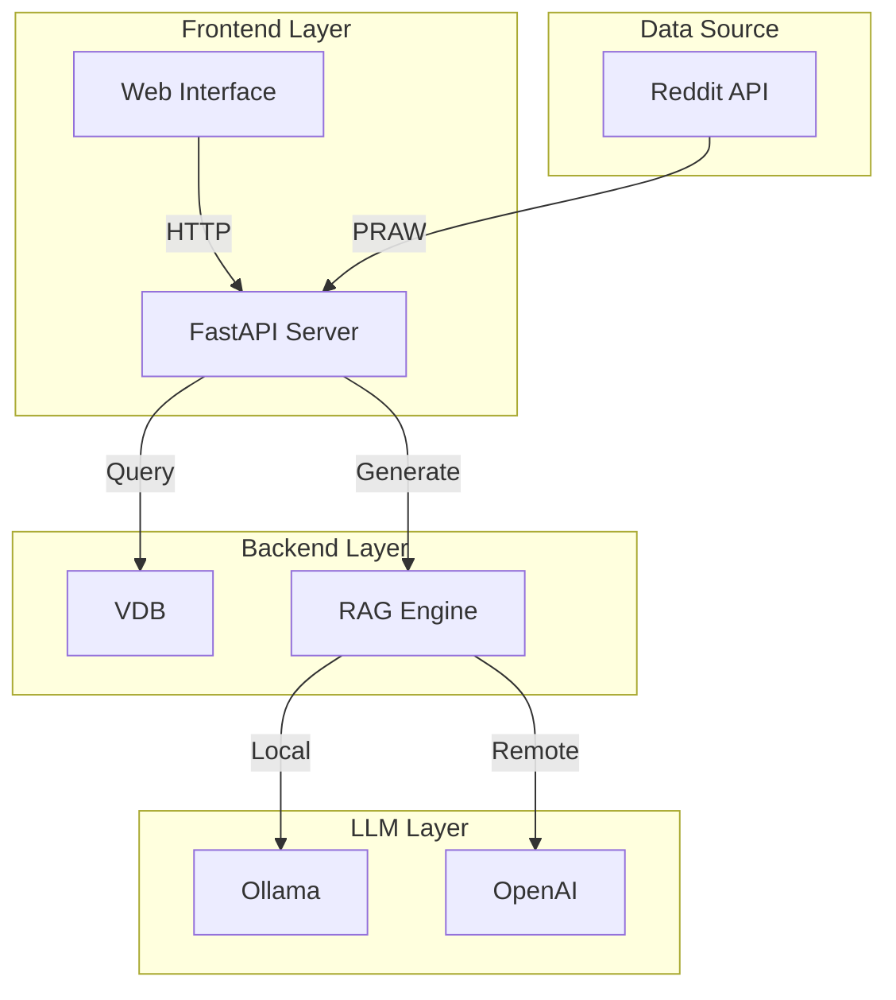

# System Architecture

```mermaid
flowchart TB
    subgraph Frontend["Frontend Layer"]
        UI[Web Interface]
        UI -->|HTTP| API
    end

    subgraph Backend["Backend Layer"]
        API[FastAPI Server]
        API -->|Query| VDB
        API -->|Generate| RAG
    end

    subgraph LLM["LLM Layer"]
        RAG[RAG Engine]
        RAG -->|Local| Ollama
        RAG -->|Remote| OpenAI
    end

    subgraph Data["Data Source"]
        Reddit[Reddit API] -->|PRAW| API
    end
```

