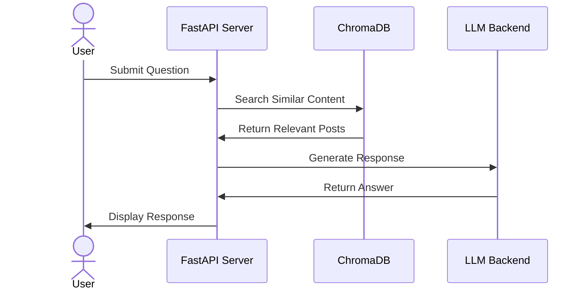

# Sequence Diagram

```mermaid
sequenceDiagram
    actor U as User;
    participant A as FastAPI Server;
    participant D as ChromaDB;
    participant L as LLM Backend;

    U->>A: Submit Question;
    A->>D: Search Similar Content;
    D->>A: Return Relevant Posts;
    A->>L: Generate Response;
    L->>A: Return Answer;
    A->>U: Display Response;
```

